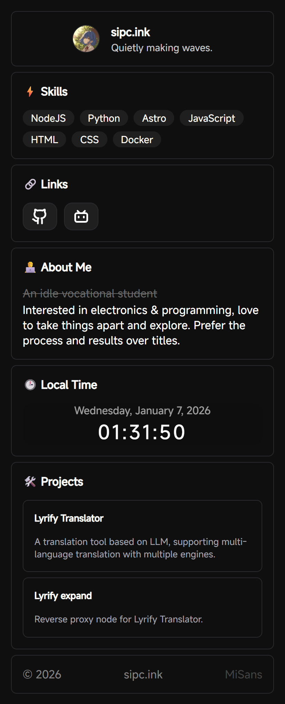
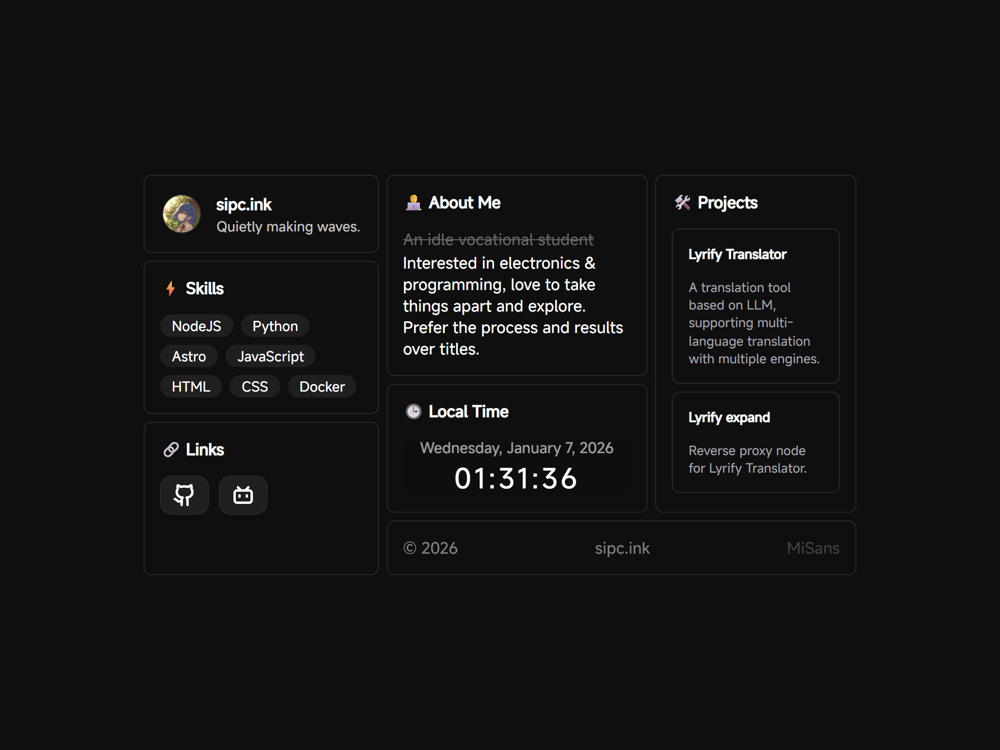

# sipc.ink

English | [中文](README.md)

A clean personal homepage built with Astro + StudioCMS UI, with built-in Chinese and English internationalization support.

## 📸 Preview

| Mobile Layout | Desktop Layout |
|---------------|----------------|
|  |  |

## 🚀 Quick Start

```bash
# Install dependencies
pnpm install

# Development mode
pnpm run dev

# Build for production
pnpm run build

# Preview production build
pnpm run preview
```

Visit http://localhost:4321 to view the site.

## 🛠️ Tech Stack

- [**Astro**](https://astro.build) - Static site generator
- [**StudioCMS UI**](https://ui.studiocms.dev/) - Component library
- [**Mi Sans**](https://hyperos.mi.com/font) - Xiaomi open source font
- [**Tastro**](https://github.com/SIPC/Tastro) - Internationalization tool

## 🌐 Internationalization (i18n)

This project has built-in multi-language support, currently including:

- **简体中文 (zh)** - Default language
- **English (en)** - English

### Language Switching
The site automatically selects the language based on the browser's language setting.

### Editing Translations
All translation texts are centrally managed in the `src/i18n/` directory:

```bash
src/i18n/
├── zh.json    # Chinese translations
└── en.json    # English translations
```

**Translation file structure example:**
```json
{
  "profile": {
    "name": "sipc.ink",
    "description": "Quietly making waves."
  },
  "about": {
    "title": "About Me",
    "old": "An idle vocational student",
    "content": "Interested in electronics & programming, love to take things apart and explore..."
  },
  "skills": {
    "title": "Skills"
  },
  "links": {
    "title": "Links"
  },
  "projects": {
    "title": "Projects",
    "lyrify_translator": {
      "name": "Lyrify Translator",
      "desc": "A translation tool based on LLM..."
    }
  },
  "time": {
    "title": "Local Time"
  },
  "footer": {
    "site": "sipc.ink",
    "font": "MiSans"
  }
}
```

**Adding a new language:**
1. Create a new JSON file in the `src/i18n/` directory (e.g., `ja.json`)
2. Add the new language to the `initTastro` configuration in `src/pages/index.astro`
3. Restart the development server

## 📝 Customization

### Modify Profile
Edit `src/cards/profile.astro`

### Update Skill Tags
Edit `src/cards/skills.astro`

### Add Projects
Edit `src/cards/projects.astro`

### Modify Social Links
Edit `src/cards/links.astro`

### Customize Layout Width
Edit `src/pages/index.astro`:
- Line 35: Modify `max-width: 730px` to adjust overall container width
- Line 88: Modify `grid-template-columns: 1fr 2fr` to adjust left-right ratio

## 📁 Project Structure

```
src/
├── cards/          # UI card components
│   ├── profile.astro    # Profile card
│   ├── about.astro      # About me card
│   ├── skills.astro     # Skills card
│   ├── links.astro      # Links card
│   ├── time.astro       # Time card
│   ├── projects.astro   # Projects card
│   └── footer.astro     # Footer card
├── i18n/           # Internationalization files
│   ├── zh.json     # Chinese translations
│   └── en.json     # English translations
└── pages/
    └── index.astro # Main entry (includes layout logic)
```

## 📄 License

MIT License
