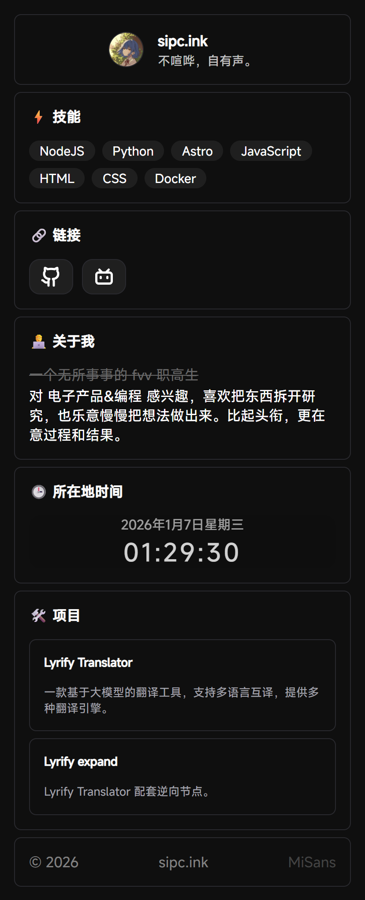
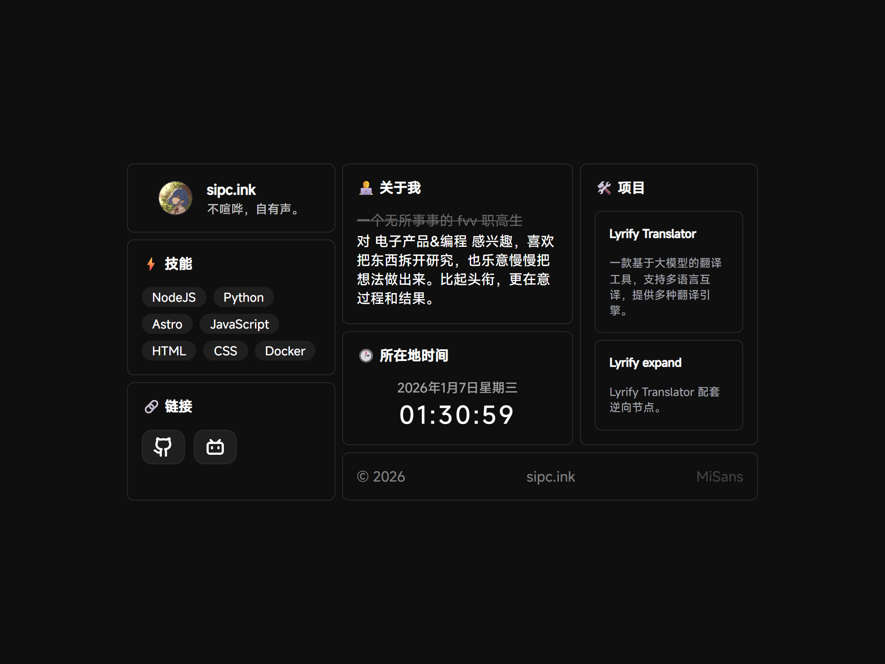

# sipc.ink

[English](README.en.md) | 中文

一个基于 Astro + StudioCMS UI 构建的简洁个人主页，支持中英文国际化。

## 📸 效果预览

| 移动端布局 | 桌面端布局 |
|------------|------------|
|  |  |

## 🚀 快速开始

```bash
# 安装依赖
pnpm install

# 开发模式
pnpm run dev

# 构建生产版本
pnpm run build

# 预览生产构建
pnpm run preview
```

访问 http://localhost:4321 查看站点。

## 🛠️ 技术栈

- [**Astro**](https://astro.build) - 静态站点生成器
- [**StudioCMS UI**](https://ui.studiocms.dev/) - 组件库
- [**Mi Sans**](https://hyperos.mi.com/font) - 小米开源字体
- [**Tastro**](https://github.com/SIPC/Tastro) - 国际化工具

## 🌐 国际化 (i18n)

本项目内置了完整的多语言支持，目前包含：

- **简体中文 (zh)** - 默认语言
- **English (en)** - 英语

### 语言切换
站点会根据浏览器语言自动选择。

### 编辑翻译内容
所有翻译文本都集中管理在 `src/i18n/` 目录下：

```bash
src/i18n/
├── zh.json    # 中文翻译
└── en.json    # 英文翻译
```

**翻译文件结构示例：**
```json
{
  "profile": {
    "name": "sipc.ink",
    "description": "不喧哗，自有声。"
  },
  "about": {
    "title": "关于我",
    "old": "一个无所事事的 fvv 职高生",
    "content": "对 电子产品&编程 感兴趣..."
  },
  "skills": {
    "title": "技能"
  },
  "links": {
    "title": "链接"
  },
  "projects": {
    "title": "项目",
    "lyrify_translator": {
      "name": "Lyrify Translator",
      "desc": "一款基于大模型的翻译工具..."
    }
  },
  "time": {
    "title": "所在地时间"
  },
  "footer": {
    "site": "sipc.ink",
    "font": "MiSans"
  }
}
```

**添加新语言：**
1. 在 `src/i18n/` 目录下创建新的 JSON 文件（如 `ja.json`）
2. 在 `src/pages/index.astro` 的 `initTastro` 配置中添加新语言
3. 重启开发服务器

## 📝 自定义内容

### 修改个人资料
编辑 `src/cards/profile.astro`

### 更新技能标签
编辑 `src/cards/skills.astro`

### 添加项目
编辑 `src/cards/projects.astro`

### 修改社交链接
编辑 `src/cards/links.astro`

### 自定义布局宽度
编辑 `src/pages/index.astro`：
- 第 35 行：修改 `max-width: 730px` 调整整体容器宽度
- 第 88 行：修改 `grid-template-columns: 1fr 2fr` 调整左右比例

## 📁 项目结构

```
src/
├── cards/          # UI 卡片组件
│   ├── profile.astro    # 个人资料卡片
│   ├── about.astro      # 关于我卡片
│   ├── skills.astro     # 技能卡片
│   ├── links.astro      # 链接卡片
│   ├── time.astro       # 时间卡片
│   ├── projects.astro   # 项目卡片
│   └── footer.astro     # 页脚卡片
├── i18n/           # 国际化文件
│   ├── zh.json     # 中文翻译
│   └── en.json     # 英文翻译
└── pages/
    └── index.astro # 主页入口（包含布局逻辑）
```

## 📄 许可证

MIT License